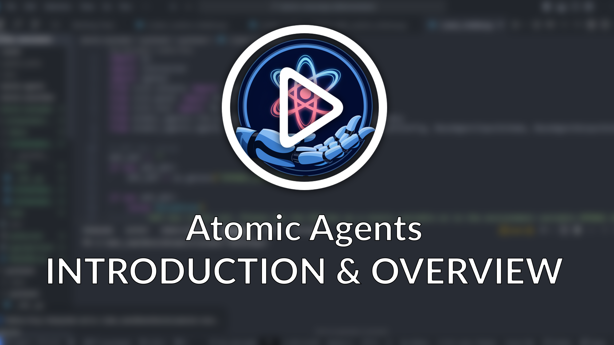
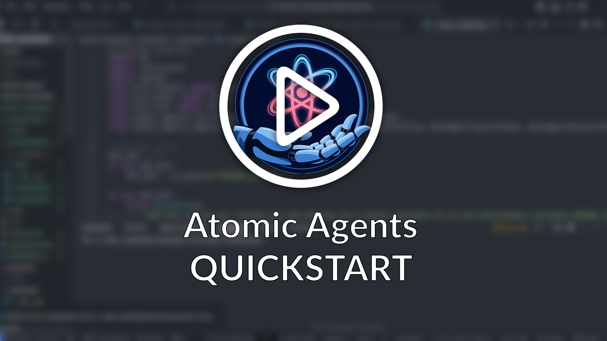
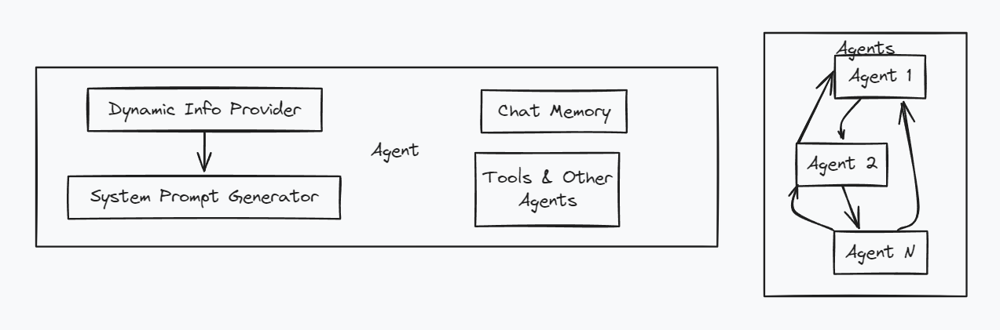
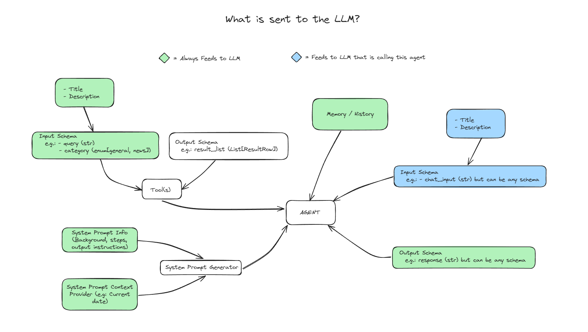
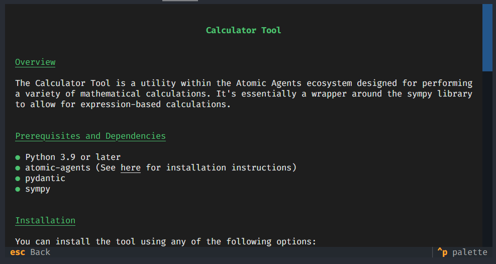
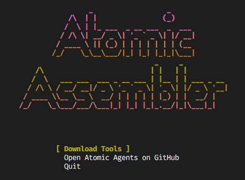

# Atomic Agents


---

[](https://badge.fury.io/py/atomic-agents)

The Atomic Agents framework is designed around the concept of atomicity to be an extremely lightweight and modular framework for building Agentic AI pipelines and applications without sacrificing developer experience and maintainability. The framework provides a set of tools and agents that can be combined to create powerful applications. It is built on top of [Instructor](https://github.com/jxnl/instructor) and leverages the power of [Pydantic](https://docs.pydantic.dev/latest/) for data and schema validation and serialization.
All logic and control flows are written in Python, enabling developers to apply familiar best practices and workflows from traditional software development without compromising flexibility or clarity.

---

If you want to learn more about the motivation and philosophy behind Atomic Agents, I suggest checking out the overview video below:

### [Watch the Overview Video](https://www.youtube.com/watch?v=Sp30YsjGUW0)
<a href="https://www.youtube.com/watch?v=Sp30YsjGUW0" target="_blank">
    
</a>

---

If you just want to dive into the code straight away, I suggest checking out the quickstart video below:

### [Watch the Quickstart Video](https://www.youtube.com/watch?v=CyZxRU0ax3Q)
<a href="https://www.youtube.com/watch?v=CyZxRU0ax3Q" target="_blank">
    
</a>

---

## Why Atomic Agents?
While existing frameworks for agentic AI focus on building autonomous multi-agent systems, they often lack the control and predictability required for real-world applications. Businesses need AI systems that produce consistent, reliable outputs aligned with their brand and objectives.

Atomic Agents addresses this need by providing:

- **Modularity:** Build AI applications by combining small, reusable components.
- **Predictability:** Define clear input and output schemas to ensure consistent behavior.
- **Extensibility:** Easily swap out components or integrate new ones without disrupting the entire system.
- **Control:** Fine-tune each part of the system individually, from system prompts to tool integrations.

## Anatomy of an Agent
In Atomic Agents, an agent is composed of several key components:

- **System Prompt:** Defines the agent's behavior and purpose.
- **Input Schema:** Specifies the structure and validation rules for the agent's input.
- **Output Schema:** Specifies the structure and validation rules for the agent's output.
- **Memory:** Stores conversation history or other relevant data.
- **Context Providers:** Inject dynamic context into the agent's system prompt at runtime.

Here's a high-level architecture diagram:
<!--  -->



## Installation
To install Atomic Agents, you can use pip:

```bash
pip install atomic-agents
```

Make sure you also install the provider you want to use. For example, to use OpenAI and Groq, you can install the `openai` and `groq` packages:

```bash
pip install openai groq
```

This also installs the CLI *Atomic Assembler*, which can be used to download Tools (and soon also Agents and Pipelines).

For local development, you can install from the repository:

```bash
git clone https://github.com/BrainBlend-AI/atomic-agents.git
cd atomic-agents
poetry install
```

## Project Structure

Atomic Agents uses a monorepo structure with the following main components:

1. `atomic-agents/`: The core Atomic Agents library
2. `atomic-assembler/`: The CLI tool for managing Atomic Agents components
3. `atomic-examples/`: Example projects showcasing Atomic Agents usage
4. `atomic-forge/`: A collection of tools that can be used with Atomic Agents

## Quickstart & Examples
A complete list of examples can be found in the [examples](./atomic-examples/) directory.

We strive to thoroughly document each example, but if something is unclear, please don't hesitate to open an issue or pull request to improve the documentation.

Here's a quick snippet demonstrating how easy it is to create a powerful agent with Atomic Agents:

```python
# Define a custom output schema
class CustomOutputSchema(BaseIOSchema):
    """
    docstring for the custom output schema
    """
    chat_message: str = Field(..., description="The chat message from the agent.")
    suggested_questions: List[str] = Field(..., description="Suggested follow-up questions.")

# Set up the system prompt
system_prompt_generator = SystemPromptGenerator(
    background=["This assistant is knowledgeable, helpful, and suggests follow-up questions."],
    steps=[
        "Analyze the user's input to understand the context and intent.",
        "Formulate a relevant and informative response.",
        "Generate 3 suggested follow-up questions for the user."
    ],
    output_instructions=[
        "Provide clear and concise information in response to user queries.",
        "Conclude each response with 3 relevant suggested questions for the user."
    ]
)

# Initialize the agent
agent = BaseAgent(
    config=BaseAgentConfig(
        client=your_openai_client,  # Replace with your actual client
        model="gpt-4o-mini",
        system_prompt_generator=system_prompt_generator,
        memory=AgentMemory(),
        output_schema=CustomOutputSchema
    )
)

# Use the agent
response = agent.run(user_input)
print(f"Agent: {response.chat_message}")
print("Suggested questions:")
for question in response.suggested_questions:
    print(f"- {question}")
```

This snippet showcases how to create a customizable agent that responds to user queries and suggests follow-up questions. For full, runnable examples, please refer to the following files in the `atomic-examples/quickstart/quickstart/` directory:

- [Basic Chatbot](/atomic-examples/quickstart/quickstart/1_basic_chatbot.py)
  A minimal chatbot example to get you started.

- [Custom Chatbot](/atomic-examples/quickstart/quickstart/2_basic_custom_chatbot.py)
  A more advanced example with a custom system prompt.

- [Custom Chatbot with Schema](/atomic-examples/quickstart/quickstart/3_basic_custom_chatbot_with_custom_schema.py)
  An advanced example featuring a custom output schema.

- [Multi-Provider Chatbot](/atomic-examples/quickstart/quickstart/4_basic_chatbot_different_providers.py)
  Demonstrates how to use different providers such as Ollama or Groq.

In addition to the quickstart examples, we have more complex examples demonstrating the power of Atomic Agents:

- [Web Search Agent](/atomic-examples/web-search-agent/README.md): An intelligent agent that performs web searches and answers questions based on the results.

- [YouTube Summarizer](/atomic-examples/youtube-summarizer/README.md): An agent that extracts and summarizes knowledge from YouTube videos.

For a complete list of examples, see the [examples directory](/atomic-examples/).

These examples provide a great starting point for understanding and using Atomic Agents.

## Context Providers

Atomic Agents allows you to enhance your agents with dynamic context using **Context Providers**. Context Providers enable you to inject additional information into the agent's system prompt at runtime, making your agents more flexible and context-aware.

### Using Context Providers

To use a Context Provider, create a class that inherits from `SystemPromptContextProviderBase` and implements the `get_info()` method, which returns the context string to be added to the system prompt.

Here's a simple example:

```python
from atomic_agents.lib.components.system_prompt_generator import SystemPromptContextProviderBase

class SearchResultsProvider(SystemPromptContextProviderBase):
    def __init__(self, title: str, search_results: List[str]):
        super().__init__(title=title)
        self.search_results = search_results

    def get_info(self) -> str:
        return "\n".join(self.search_results)
```

You can then register your Context Provider with the agent:

```python
# Initialize your context provider with dynamic data
search_results_provider = SearchResultsProvider(
    title="Search Results",
    search_results=["Result 1", "Result 2", "Result 3"]
)

# Register the context provider with the agent
agent.register_context_provider("search_results", search_results_provider)
```

This allows your agent to include the search results (or any other context) in its system prompt, enhancing its responses based on the latest information.

## Chaining Schemas and Agents

Atomic Agents makes it easy to chain agents and tools together by aligning their input and output schemas. This design allows you to swap out components effortlessly, promoting modularity and reusability in your AI applications.

### Example: Generating Queries for Different Search Providers

Suppose you have an agent that generates search queries and you want to use these queries with different search tools. By aligning the agent's output schema with the input schema of the search tool, you can easily chain them together or switch between different search providers.

Here's how you can achieve this:

```python
import instructor
import openai
from pydantic import Field
from atomic_agents.agents.base_agent import BaseIOSchema, BaseAgent, BaseAgentConfig
from atomic_agents.lib.components.system_prompt_generator import SystemPromptGenerator

# Import the search tool you want to use
from web_search_agent.tools.searxng_search import SearxNGSearchTool

# Define the input schema for the query agent
class QueryAgentInputSchema(BaseIOSchema):
    """Input schema for the QueryAgent."""
    instruction: str = Field(..., description="Instruction to generate search queries for.")
    num_queries: int = Field(..., description="Number of queries to generate.")

# Initialize the query agent
query_agent = BaseAgent(
    BaseAgentConfig(
        client=instructor.from_openai(openai.OpenAI()),
        model="gpt-4o-mini",
        system_prompt_generator=SystemPromptGenerator(
            background=[
                "You are an intelligent query generation expert.",
                "Your task is to generate a specified number of diverse and highly relevant queries based on a given instruction."
            ],
            steps=[
                "Receive the instruction and the number of queries to generate.",
                "Generate the queries in JSON format."
            ],
            output_instructions=[
                "Ensure each query is unique and relevant.",
                "Provide the queries in the expected schema."
            ],
        ),
        input_schema=QueryAgentInputSchema,
        output_schema=SearxNGSearchTool.input_schema,  # Align output schema
    )
)
```

In this example:

- **Modularity**: By setting the `output_schema` of the `query_agent` to match the `input_schema` of `SearxNGSearchTool`, you can directly use the output of the agent as input to the tool.
- **Swapability**: If you decide to switch to a different search provider, you can import a different search tool and update the `output_schema` accordingly.

For instance, to switch to another search service:

```python
# Import a different search tool
from web_search_agent.tools.another_search import AnotherSearchTool

# Update the output schema
query_agent.config.output_schema = AnotherSearchTool.input_schema
```

This design pattern simplifies the process of chaining agents and tools, making your AI applications more adaptable and easier to maintain.

## Running the CLI
To run the CLI, simply run the following command:

```bash
atomic
```

Or if you installed Atomic Agents with Poetry, for example:

```bash
poetry run atomic
```

Or if you installed Atomic Agents with uv:

```bash
uv run atomic
```

After running this command, you will be presented with a menu allowing you to download tools.

Each tool's has its own:
- Input schema
- Output schema
- Usage example
- Dependencies
- Installation instructions



The `atomic-assembler` CLI gives you complete control over your tools, avoiding the clutter of unnecessary dependencies. It makes modifying tools straightforward additionally, each tool comes with its own set of tests for reliability.

**But you're not limited to the CLI!** If you prefer, you can directly access the tool folders and manage them manually by simply copying and pasting as needed.



## Provider & Model Compatibility
Atomic Agents depends on the [Instructor](https://github.com/jxnl/instructor) package. This means that in all examples where OpenAI is used, any other API supported by Instructor can also be used—such as Ollama, Groq, Mistral, Cohere, Anthropic, Gemini, and more. For a complete list, please refer to the Instructor documentation on its [GitHub page](https://github.com/jxnl/instructor).

## API Documentation
API documentation can be found [here](https://brainblend-ai.github.io/atomic-agents/).

## Atomic Forge

Atomic Forge is a collection of tools that can be used with Atomic Agents to extend its functionality. Current tools include:

- Calculator
- SearxNG Search
- YouTube Transcript Scraper

For more information on using and creating tools, see the [Atomic Forge README](/atomic-forge/README.md).

## Contributing

We welcome contributions! Please see the [Developer Guide](/guides/DEV_GUIDE.md) for detailed information on how to contribute to Atomic Agents. Here are some quick steps:

1. Fork the repository
2. Create a new branch (`git checkout -b feature-branch`)
3. Make your changes
4. Run tests (`poetry run pytest --cov=atomic_agents atomic-agents`)
5. Format your code (`poetry run black atomic-agents atomic-assembler atomic-examples atomic-forge`)
6. Lint your code (`poetry run flake8 --extend-exclude=.venv atomic-agents atomic-assembler atomic-examples atomic-forge`)
7. Commit your changes (`git commit -m 'Add some feature'`)
8. Push to the branch (`git push origin feature-branch`)
9. Open a pull request

For full development setup and guidelines, please refer to the [Developer Guide](/guides/DEV_GUIDE.md).

## License
This project is licensed under the MIT License—see the [LICENSE](LICENSE) file for details.

## Star History

[](https://star-history.com/#BrainBlend-AI/atomic-agents&Date)
