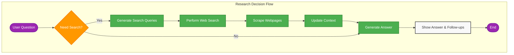
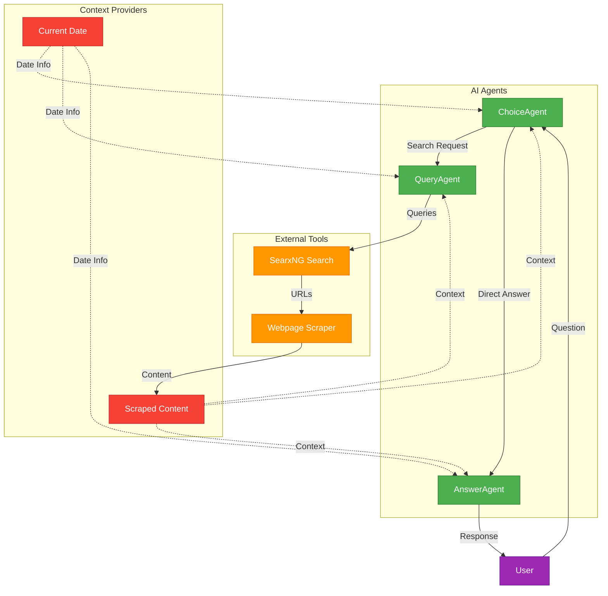

```mermaid
flowchart TD
    %% Decision Flow Diagram
    subgraph DecisionFlow["Research Decision Flow"]
        Start([User Question]) --> B{Need Search?}
        B -->|Yes| C[Generate Search Queries]
        C --> D[Perform Web Search]
        D --> E[Scrape Webpages]
        E --> F[Update Context]
        F --> G[Generate Answer]
        B -->|No| G
        G --> H[Show Answer & Follow-ups]
        H --> End([End])
    end

    classDef default fill:#f9f9f9,stroke:#333,stroke-width:2px;
    classDef decision fill:#ff9800,stroke:#f57c00,color:#fff;
    classDef process fill:#4caf50,stroke:#388e3c,color:#fff;
    classDef terminator fill:#9c27b0,stroke:#7b1fa2,color:#fff;

    class B decision;
    class C,D,E,F,G process;
    class Start,End terminator;

```

```mermaid
graph TD
    %% System Architecture Diagram
    subgraph Agents["AI Agents"]
        CA[ChoiceAgent]
        QA[QueryAgent]
        AA[AnswerAgent]
    end

    subgraph Tools["External Tools"]
        ST[SearxNG Search]
        WS[Webpage Scraper]
    end

    subgraph Context["Context Providers"]
        SC[Scraped Content]
        CD[Current Date]
    end

    %% Connections
    User -->|Question| CA
    CA -->|Search Request| QA
    QA -->|Queries| ST
    ST -->|URLs| WS
    WS -->|Content| SC
    SC -.->|Context| CA & QA & AA
    CD -.->|Date Info| CA & QA & AA
    CA -->|Direct Answer| AA
    AA -->|Response| User

    %% Styling
    classDef agent fill:#4CAF50,stroke:#2E7D32,color:#fff;
    classDef tool fill:#FF9800,stroke:#EF6C00,color:#fff;
    classDef context fill:#F44336,stroke:#C62828,color:#fff;
    classDef user fill:#9C27B0,stroke:#6A1B9A,color:#fff;

    class CA,QA,AA agent;
    class ST,WS tool;
    class SC,CD context;
    class User user;

```
