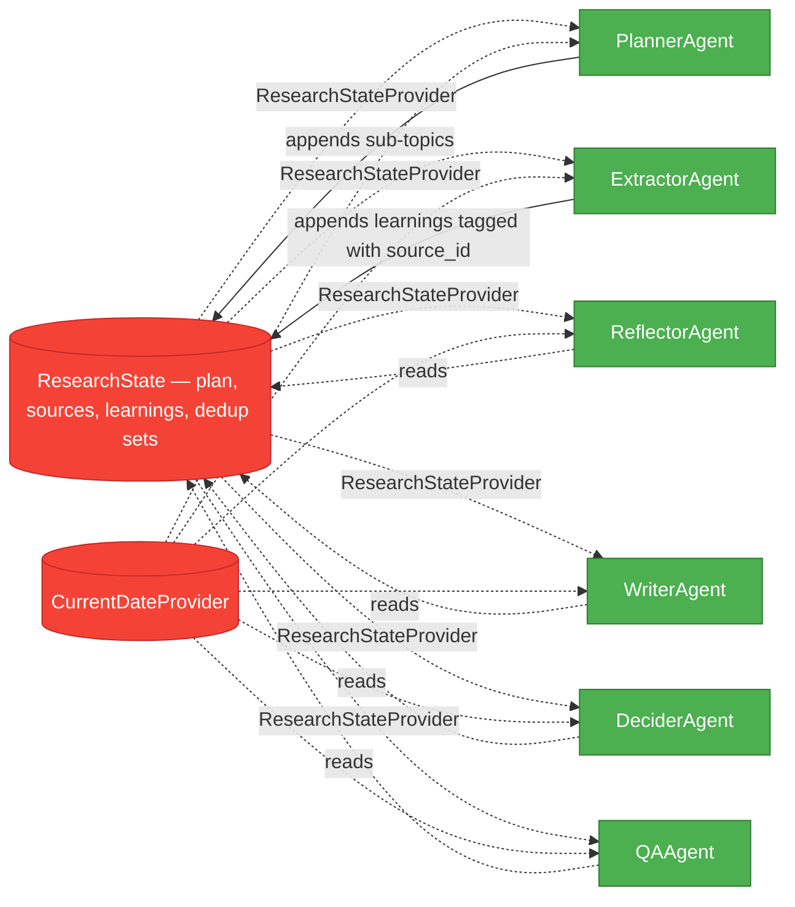

```mermaid
flowchart TD
    %% Pipeline overview — first turn
    Start([User question]) --> P[PlannerAgent]
    P -->|sub-topics + initial queries| Loop

    subgraph Loop["Per sub-topic — bounded by max_depth_per_sub_topic"]
        S[SearXNG search] --> Sc[Webpage scraper]
        Sc --> E[ExtractorAgent]
        E -->|claims tagged with source_id| R{ReflectorAgent}
        R -->|sufficient = true| Done
        R -->|next_queries| S
    end

    Done --> W1[WriterAgent — draft]
    W1 --> W2[WriterAgent — verify]
    W2 --> Out([Cited markdown report])

    classDef agent fill:#4CAF50,stroke:#2E7D32,color:#fff;
    classDef tool fill:#FF9800,stroke:#EF6C00,color:#fff;
    classDef terminator fill:#9C27B0,stroke:#6A1B9A,color:#fff;

    class P,E,W1,W2 agent;
    class R agent;
    class S,Sc tool;
    class Start,Out,Done terminator;
```

```mermaid
flowchart TD
    %% Chat-mode routing — every turn after the first
    U([Follow-up message]) --> D{DeciderAgent}
    D -->|needs_research = true| Plan[PlannerAgent — extend coverage]
    Plan --> Research[Search → Scrape → Extract → Reflect]
    Research --> QA[QAAgent]
    D -->|needs_research = false| QA
    QA --> Reply([Cited answer + follow-ups])

    classDef agent fill:#4CAF50,stroke:#2E7D32,color:#fff;
    classDef terminator fill:#9C27B0,stroke:#6A1B9A,color:#fff;

    class D,Plan,QA agent;
    class Research agent;
    class U,Reply terminator;
```

```mermaid
graph LR
    %% Shared state — every agent reads from / contributes to ResearchState
    State[(ResearchState — plan, sources, learnings, dedup sets)]

    Planner[PlannerAgent] -->|appends sub-topics| State
    Extractor[ExtractorAgent] -->|appends learnings tagged with source_id| State
    Reflector[ReflectorAgent] -.->|reads| State
    Writer[WriterAgent] -.->|reads| State
    Decider[DeciderAgent] -.->|reads| State
    QA[QAAgent] -.->|reads| State

    State -. ResearchStateProvider .-> Planner & Extractor & Reflector & Writer & Decider & QA
    Date[(CurrentDateProvider)] -.-> Planner & Extractor & Reflector & Writer & Decider & QA

    classDef agent fill:#4CAF50,stroke:#2E7D32,color:#fff;
    classDef state fill:#F44336,stroke:#C62828,color:#fff;

    class Planner,Extractor,Reflector,Writer,Decider,QA agent;
    class State,Date state;
```
