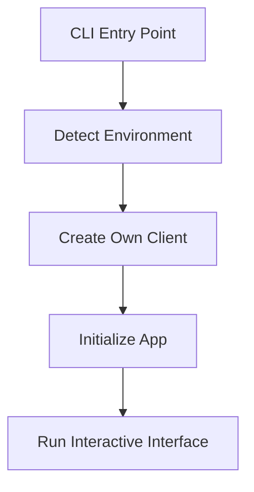
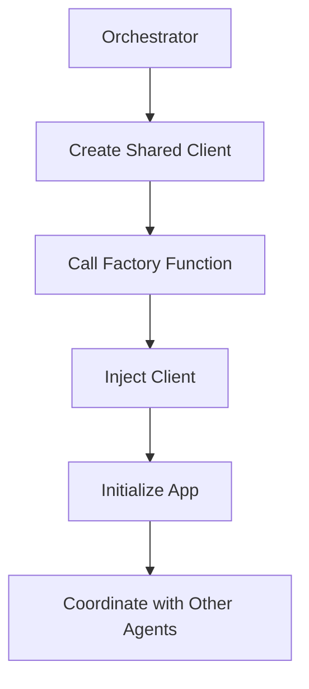

gi# Atomic Scraper Tool - Architecture Documentation

## Overview

The Atomic Scraper Tool demonstrates a **next-generation architecture** for AI-powered applications that need to operate in multiple execution contexts. This document captures the key architectural insights and design patterns that make this tool truly versatile.

## 🎯 Core Architecture Principle: Model Provider Injection

### The Challenge

Modern AI applications face a fundamental challenge: they need to work seamlessly across different execution contexts:

1. **Standalone Applications**: Independent tools with their own model providers
2. **Orchestrated Systems**: Multi-agent workflows with shared model providers  
3. **CLI Ecosystems**: Command-line tools coordinating multiple AI components
4. **Web Services**: Applications with centralized model management
5. **Enterprise Deployments**: Systems with specific provider requirements

### Traditional Approach (❌ Anti-Pattern)

```python
# ❌ Hardcoded model provider - inflexible
class ScrapingAgent:
    def __init__(self):
        self.client = openai.OpenAI()  # Hardcoded!
        self.model = "gpt-3.5-turbo"  # Fixed!

# Problems:
# - Cannot share providers across agents
# - Difficult to test with mock clients
# - No resource pooling or rate limiting coordination
# - Configuration scattered across components
```

### Atomic Agents Pattern (✅ Best Practice)

```python
# ✅ Model provider injection - maximum flexibility
class AtomicScraperApp:
    def __init__(self, config_path: Optional[str] = None, client: Optional[Any] = None):
        self.injected_client = client  # Flexible injection point
        self.config = self._load_config()
        
        if self.injected_client:
            # Orchestrated mode: Use injected client
            self._initialize_with_injected_client()
        else:
            # Standalone mode: Create own client
            self._initialize_standalone_client()

# Benefits:
# ✅ Context-adaptive behavior
# ✅ Resource efficiency through sharing
# ✅ Consistent configuration across agents
# ✅ Easy testing with mock clients
# ✅ Scalable multi-agent coordination
```

## 🏗️ Architecture Components

### 1. Application Layer (main.py)

**Responsibility**: Entry point and execution context detection

```python
class AtomicScraperApp:
    """
    Main application with dual-mode initialization:
    - Standalone: Uses environment-based configuration
    - Orchestrated: Uses injected model provider
    """
```

**Key Features**:
- Automatic execution mode detection
- Client injection support
- Configuration management
- Error handling and recovery

### 2. Agent Layer (agents/)

**Responsibility**: AI-powered planning and coordination

```python
class AtomicScraperPlanningAgent(BaseAgent):
    """
    Planning agent that receives client from application layer
    """
    def __init__(self, config: BaseAgentConfig):
        super().__init__(config)  # Client injected via config
```

**Key Features**:
- Inherits from atomic-agents BaseAgent
- Receives client through configuration
- Focuses on domain logic, not infrastructure

### 3. Tool Layer (tools/)

**Responsibility**: Core scraping functionality

```python
class AtomicScraperTool:
    """
    Model-agnostic scraping tool focused on core functionality
    """
    def __init__(self, config: AtomicScraperConfig):
        # No direct model provider dependency
        self.config = config
```

**Key Features**:
- Model provider agnostic
- Pure functional implementation
- Testable without AI dependencies

### 4. Configuration Layer (config/)

**Responsibility**: Centralized configuration management

```python
class AtomicScraperConfig:
    """
    Configuration that supports both standalone and orchestrated modes
    """
```

**Key Features**:
- Environment variable detection
- Configuration inheritance
- Validation and defaults

## 🔄 Execution Flow Patterns

### Standalone Mode Flow



1. **Environment Detection**: Check for API keys (OPENAI_API_KEY, etc.)
2. **Client Creation**: Create appropriate client based on available keys
3. **App Initialization**: Initialize with self-created client
4. **Interactive Mode**: Full CLI interface with all features

### Orchestrated Mode Flow



1. **Orchestrator Control**: External system manages the workflow
2. **Shared Client**: Single client instance across all agents
3. **Factory Function**: `create_orchestrated_app()` handles injection
4. **Coordination**: App works with other agents in the ecosystem

## 🎨 Design Patterns

### 1. Factory Pattern

```python
def create_orchestrated_app(config: Optional[Dict[str, Any]] = None, 
                          client: Optional[Any] = None) -> AtomicScraperApp:
    """
    Factory function for orchestration scenarios
    """
    return AtomicScraperApp(config_path=config_path, client=client)
```

**Benefits**:
- Clean separation of concerns
- Easy integration for orchestrators
- Consistent initialization

### 2. Strategy Pattern

```python
def _initialize_components(self):
    if self.injected_client:
        self._initialize_planning_agent_with_client(self.injected_client)
    else:
        self._initialize_planning_agent_standalone()
```

**Benefits**:
- Different initialization strategies
- Context-appropriate behavior
- Maintainable code paths

### 3. Dependency Injection Pattern

```python
class AtomicScraperPlanningAgent(BaseAgent):
    def __init__(self, config: BaseAgentConfig):
        # Client injected through config
        super().__init__(config)
```

**Benefits**:
- Loose coupling
- Easy testing
- Flexible configuration

## 🌐 Ecosystem Integration

### Metadata Pattern

```python
def get_orchestration_metadata() -> Dict[str, Any]:
    """
    Provides metadata for ecosystem discovery
    """
    return {
        "name": "atomic-scraper-tool",
        "supports_client_injection": True,
        "factory_function": "atomic_scraper_tool.main.create_orchestrated_app",
        "execution_modes": ["standalone", "orchestrated"]
    }
```

**Benefits**:
- Automatic tool discovery
- Integration capability advertisement
- Version and compatibility information

### Client Abstraction

```python
# Works with any instructor-compatible client
client = instructor.from_openai(openai.OpenAI())
client = instructor.from_anthropic(anthropic.Anthropic())
client = instructor.from_azure_openai(azure_openai.AzureOpenAI())

# All work with the same injection pattern
app = create_orchestrated_app(client=client)
```

**Benefits**:
- Provider agnostic
- Easy switching between providers
- Future-proof architecture

## 🔧 Implementation Guidelines

### For Tool Developers

1. **Always support client injection** at the application level
2. **Detect execution context** and adapt behavior accordingly
3. **Provide factory functions** for orchestration scenarios
4. **Include metadata** for ecosystem discovery
5. **Separate concerns** between application, agent, and tool layers

### For Orchestrator Developers

1. **Create shared clients** for resource efficiency
2. **Use factory functions** rather than direct instantiation
3. **Check metadata** for integration capabilities
4. **Handle errors gracefully** when tools don't support injection
5. **Coordinate configuration** across all agents

### For Enterprise Deployments

1. **Centralize model provider management**
2. **Use orchestrated mode** for consistency
3. **Implement proper monitoring** across all components
4. **Configure rate limiting** at the client level
5. **Plan for scaling** with shared resources

## 📊 Benefits Analysis

| Aspect | Traditional Approach | Atomic Agents Pattern | Improvement |
|--------|---------------------|----------------------|-------------|
| **Flexibility** | Fixed provider | Adaptable to context | 🚀 High |
| **Resource Usage** | Individual connections | Shared resources | 💰 Cost effective |
| **Testing** | Hard to mock | Easy injection | 🧪 Much easier |
| **Scalability** | Limited | Multi-agent ready | 📈 Enterprise ready |
| **Maintenance** | Scattered config | Centralized | 🔧 Much easier |
| **Integration** | Manual work | Automatic discovery | ⚡ Seamless |

## 🚀 Future Considerations

### Planned Enhancements

1. **Dynamic Provider Switching**: Runtime provider changes
2. **Load Balancing**: Multiple providers for high availability
3. **Cost Optimization**: Automatic provider selection based on cost
4. **Advanced Monitoring**: Detailed metrics and alerting
5. **Plugin Architecture**: Third-party provider support

### Ecosystem Evolution

1. **Standard Interfaces**: Common patterns across atomic-agents tools
2. **Discovery Protocol**: Automatic tool discovery and integration
3. **Configuration Management**: Centralized config for large deployments
4. **Security Framework**: Secure credential management
5. **Performance Optimization**: Advanced caching and optimization

## 📝 Conclusion

The **Model Provider Injection Pattern** represents a fundamental shift in how AI applications should be architected. By separating infrastructure concerns (model providers) from business logic (scraping functionality), we create applications that are:

- **Truly versatile**: Work in any execution context
- **Resource efficient**: Share connections and configuration
- **Easy to test**: Mock injection for comprehensive testing
- **Future-proof**: Adapt to new providers and patterns
- **Enterprise ready**: Scale to complex multi-agent workflows

This pattern should be considered a **best practice** for any AI application that needs to integrate with larger ecosystems or work across different deployment scenarios.